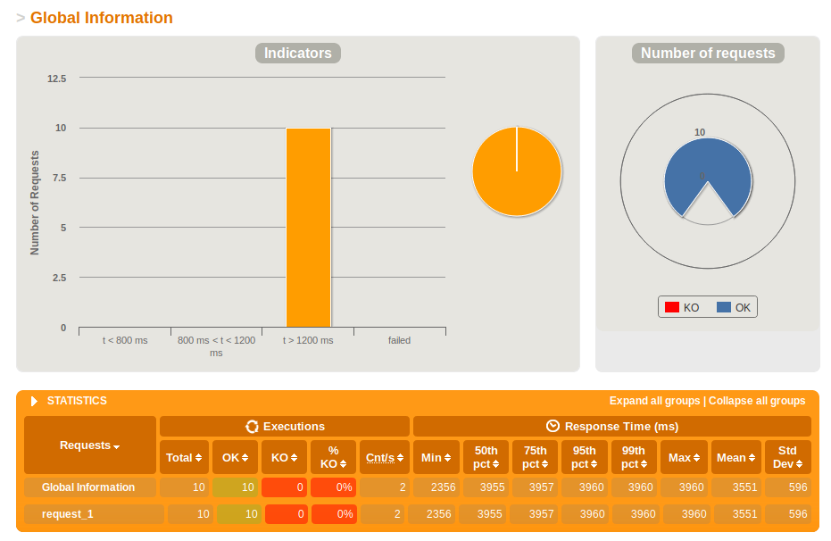
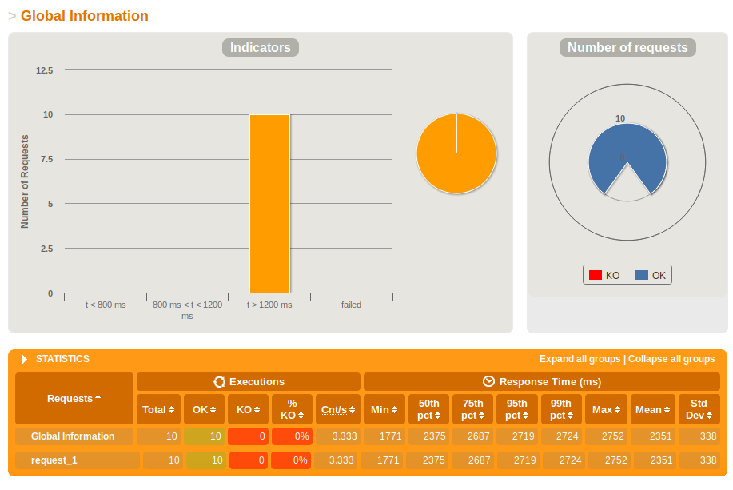
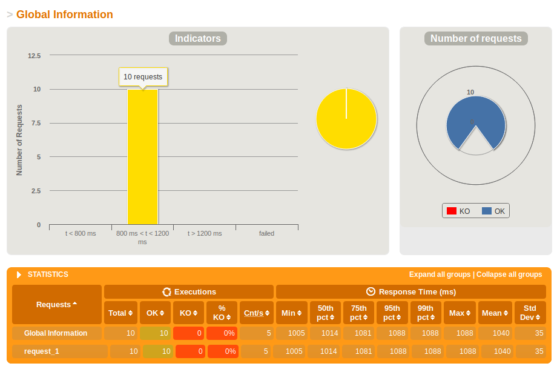
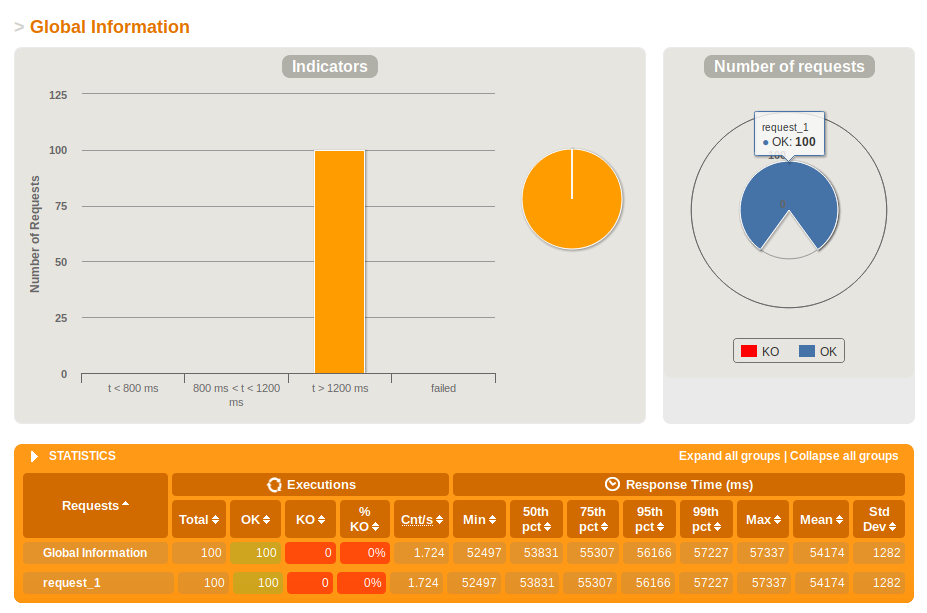
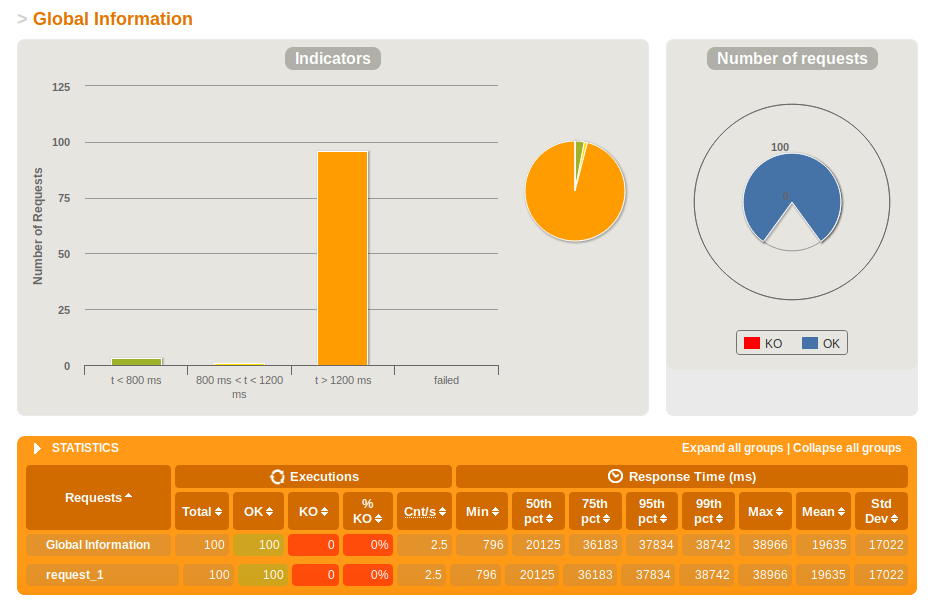
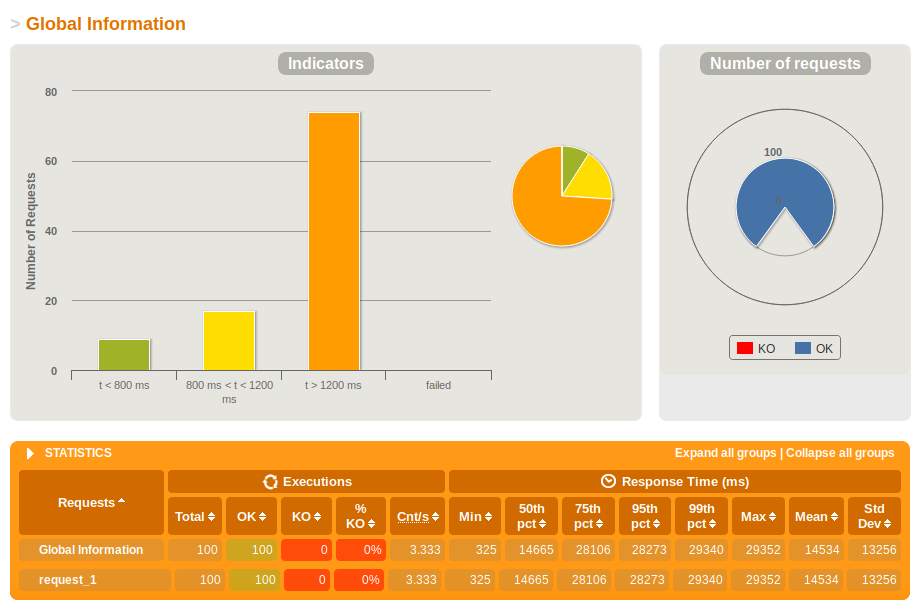
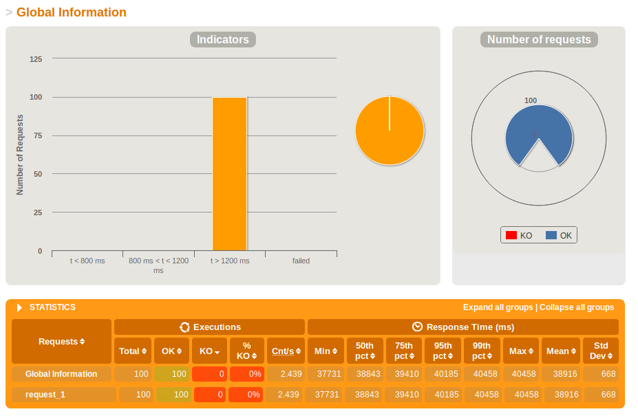
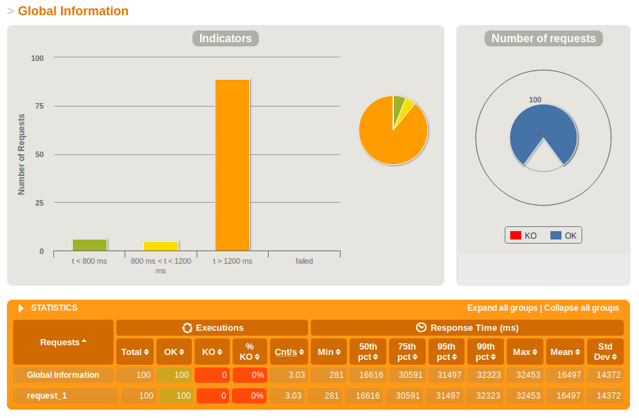
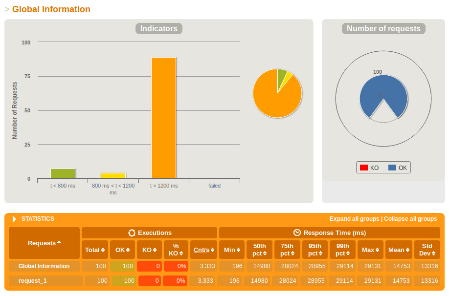
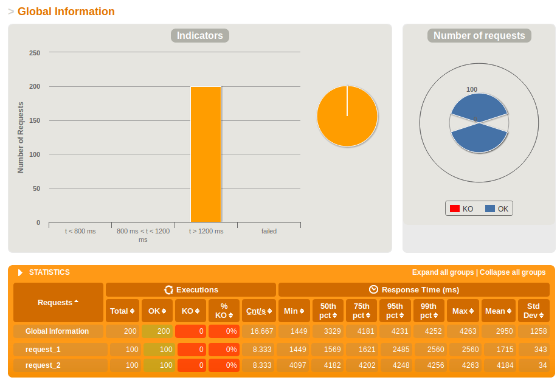

# Report

## Scale Up

设置cpus为0.5，1，1.5，进行垂直扩展的负载测试，结果如下：

1. scale-up-0.5:

   

2. scale-up-1:

   

3. scale-up-1.5:

   

随着垂直扩展的规模增大，平均响应时间大幅度缩短，服务器性能得到显著提升。

## Load Balance

设置cups为0.5，分别运行1，2，4个镜像，进行水平扩展，负载均衡的负载测试，结果如下：

1. load-balance-1:

   

2. load-balance-2:

   

3. load-balance-4:

   

随着水平扩展的规模增大，在起初响应时间有所缩短，服务器性能提升显著，但在更大规模上并不能得到显著提升，提升所需成本较高。

## Cache

在Load Balance的基础上引入缓存机制进行负载测试，结果如下：

1. cache-1:

   

2. cache-2:

   

3. cache-4:

   

对比引入缓存机制前后的平均响应时间，可以发现缓存机制能够帮助服务器减少响应时间，缓存可以在一定程度上提高服务器性能。

## Redis

使用Redis解决Cache Missing和Session Share问题并进行测试，结果如下：



使用Redis后平均响应时间较短，可以解决Cache Missing和Session Share问题。

# WebPOS

The demo shows a web POS system , which replaces the in-memory product db in aw03 with a one backed by 京东.


To run

```shell
mvn clean spring-boot:run
```

Currently, it creates a new session for each user and the session data is stored in an in-memory h2 db. 
And it also fetches a product list from jd.com every time a session begins.

1. Build a docker image for this application and performance a load testing against it.
2. Make this system horizontally scalable by using haproxy and performance a load testing against it.
3. Take care of the **cache missing** problem (you may cache the products from jd.com) and **session sharing** problem (you may use a standalone mysql db or a redis cluster). Performance load testings.

Please **write a report** on the performance differences you notices among the above tasks.

